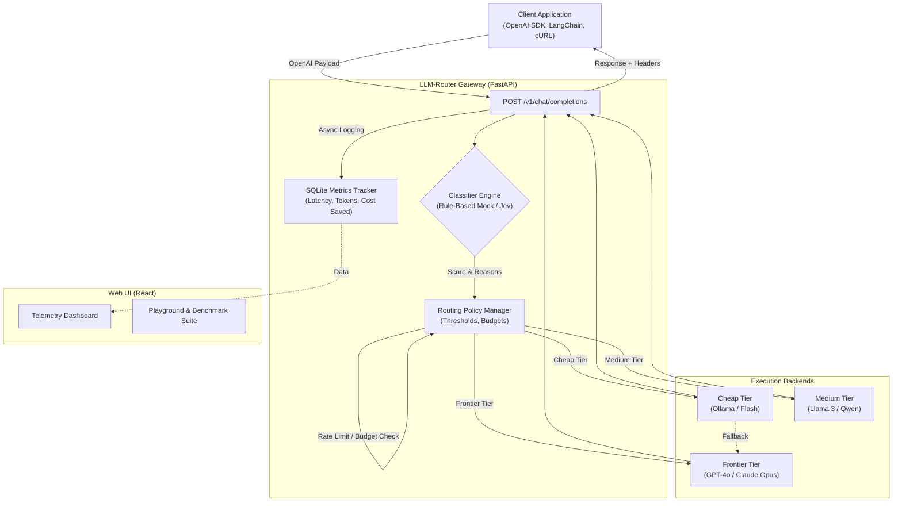

# LLM-Router 🚀


An intelligent, OpenAI-Compatible API Gateway with cost-optimized dynamic routing. 

LLM-Router cuts LLM inference costs by intelligently analyzing incoming prompts and routing routine/simple queries to cheap or local models, while reserving frontier LLMs (such as Claude Opus 5.5, GPT-6 Astra, Gemini 3.1 Pro) only for high-complexity reasoning tasks. It's completely transparent to the client application.

## ✨ Key Features
- **🧠 Three-Tier Intelligent Routing**: Accurately classifies prompts into `cheap`, `medium`, and `frontier` tiers based on syntax, reasoning keywords, code, context length, and dialogue depth.
- **🎯 Curated 8-Provider Catalog**: 23 verified September 2026 models from Anthropic, OpenAI, Google, Qwen, Mistral, DeepSeek, Meta, and xAI with verified pricing and empirical benchmarks.
- **💰 Automatic Cost Savings**: Cuts overall API spending by up to 80% with real-time per-request and per-1K savings estimation.
- **📊 Real-time Telemetry Dashboard**: Interactive charts showing traffic, model distribution, latency, and cumulative cost savings.
- **📈 Deep Analytics & Telemetry**: Rich metrics via `/v1/analytics` and `/v1/catalog/summary` tracking efficiency and hourly time-series.
- **⚡ Interactive Benchmark Suite**: Evaluate candidate models against test prompt batteries with instant latency, cost, and fit comparison.
- **🛡️ Rate Limiting & Budgets**: Set a monthly budget with visual progress alerts and automatic HTTP 429 enforcement.
- **🔑 UI-Configurable API Keys**: Secure client-side API key configuration for all 8 providers stored in localStorage.
- **🔁 Automatic Fallbacks**: Resilient upstream routing that gracefully falls back to frontier models or simulated responses.
- **🔌 OpenAI Compatible**: Drop-in replacement for OpenAI API (`/v1/chat/completions`); just change the base URL.


## 🚀 Quickstart

**Docker (Recommended):**
```bash
cp .env.example .env
docker compose up --build
```
- Gateway API: `http://localhost:8000`
- Web Dashboard & Playground: `http://localhost:3000`

**Local Development:**
```bash
# Start Backend
python3 -m venv .venv
source .venv/bin/activate
pip install -r requirements.txt
cp .env.example .env
uvicorn app.main:app --host 0.0.0.0 --port 8000

# Start Frontend
cd web && npm install && npm run dev
```

## 🏗️ Architecture



## 📋 Curated Model Catalog (September 2026)

LLM-Router restricts its active catalog to **8 premier providers** with verified pricing and empirical benchmark scores across Reasoning, Coding, Summary, and Creative tasks:

| Provider | Latest Models | Tiers | Price ($/1M in / out) |
|---|---|---|---|
| **Anthropic** | Claude Opus 5.5, Claude Fable 5.1, Claude Sonnet 5, Claude Haiku 4.5 | Frontier / Medium / Cheap | $1.00 – $10.00 / $5.00 – $50.00 |
| **OpenAI** | GPT-6 Astra, GPT-5.6 Sol, GPT-5.6 Terra, GPT-5.6 Luna | Frontier / Medium / Cheap | $0.20 – $10.00 / $1.20 – $50.00 |
| **Google** | Gemini 3.1 Pro, Gemini 3.8 Flash, Gemini 3.5 Flash-Lite | Frontier / Medium / Cheap | $0.30 – $2.00 / $2.50 – $12.00 |
| **Qwen** | Qwen 3.8 Max, Qwen 3.8 Max Prime, Qwen 3.8 27B | Frontier / Cheap | $0.10 – $4.00 / $0.50 – $12.00 |
| **Mistral** | Mistral Large 3, Mistral Small 4 | Medium / Cheap | $0.15 – $0.50 / $0.60 – $1.50 |
| **DeepSeek** | DeepSeek V4 Pro, DeepSeek V4.1 Flash | Medium / Cheap | $0.30 – $1.32 / $1.20 – $3.96 |
| **Meta** | Muse Spark 1.3, Llama 4 Maverick, Llama 4 Scout | Frontier / Medium / Cheap | $0.05 – $1.25 / $0.30 – $4.25 |
| **xAI** | Grok 4.7, Grok 4.7 Fast | Frontier / Medium | $1.00 – $2.00 / $3.00 – $6.00 |

Detailed benchmarks and sources can be found in [docs/benchmarks.md](docs/benchmarks.md).

## ⚙️ Configuration (.env)

| Variable | Default | Description |
|---|---|---|
| `PORT` | `8000` | HTTP port for the FastAPI gateway |
| `CLASSIFIER_MODE` | `mock` | `mock` (rule-based heuristic) or `jev` (TypeSafe AI) |
| `MONTHLY_BUDGET_USD` | `0.0` | Maximum monthly budget in USD (0.0 = unlimited) |
| `CHEAP_PROVIDER` | `ollama` | Provider for cheap tier (`ollama`, `openai_compatible`) |
| `FRONTIER_PROVIDER` | `anthropic` | Provider for frontier tier (`anthropic`, `openai`, etc.) |
| `SIMULATE_FALLBACK` | `true` | Returns simulated responses if upstream APIs fail |
| `OPENAI_API_KEY` | *(empty)* | Optional API key for OpenAI |
| `ANTHROPIC_API_KEY` | *(empty)* | Optional API key for Anthropic |
| `GOOGLE_API_KEY` | *(empty)* | Optional API key for Google Gemini |
| `QWEN_API_KEY` | *(empty)* | Optional API key for Qwen (DashScope) |
| `MISTRAL_API_KEY` | *(empty)* | Optional API key for Mistral AI |
| `DEEPSEEK_API_KEY` | *(empty)* | Optional API key for DeepSeek |
| `META_API_KEY` | *(empty)* | Optional API key for Meta Llama |
| `XAI_API_KEY` | *(empty)* | Optional API key for xAI |

## 🤝 Contributing
Contributions are welcome! Please check the issues page or open a PR.

