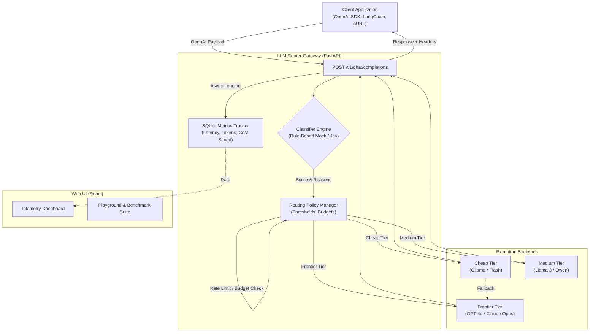

# LLM-Router 🚀


An intelligent, OpenAI-Compatible API Gateway with cost-optimized dynamic routing. 

LLM-Router cuts LLM inference costs by intelligently analyzing incoming prompts and routing routine/simple queries to cheap or local models, while reserving frontier LLMs (like GPT-4o or Claude 3.5 Sonnet) only for high-complexity reasoning tasks. It's completely transparent to the client application.

## ✨ Key Features
- **🧠 Intelligent Routing**: Routes based on reasoning complexity, code detection, and context length.
- **💰 Automatic Cost Savings**: Cuts costs by up to 80% without sacrificing quality.
- **📊 Real-time Telemetry Dashboard**: View traffic, routing distribution, and actual $ saved in real-time.
- **⚡ Benchmark Mode**: Interactive suite to send standard prompts across multiple models and compare latency/cost.
- **🛡️ Rate Limiting & Budgets**: Set a monthly budget to cap spending; automatically rejects requests with HTTP 429 when exceeded.
- **🔌 OpenAI Compatible**: Drop-in replacement for OpenAI API; just change the base URL.
- **🔑 UI-Configurable API Keys**: Configure API keys per provider securely in your browser's local storage for testing in the Playground.
- **🔁 Automatic Fallbacks**: Transparently retries requests on frontier models if a local/cheap model fails.

## 🚀 Quickstart

**Docker (Recommended):**
```bash
cp .env.example .env
docker compose up --build
```
- Gateway API: `http://localhost:8000`
- Web Dashboard & Playground: `http://localhost:3000`

**Local Development:**
```bash
# Start Backend
python3 -m venv .venv
source .venv/bin/activate
pip install -r requirements.txt
cp .env.example .env
uvicorn app.main:app --host 0.0.0.0 --port 8000

# Start Frontend
cd web && npm install && npm run dev
```

## 🏗️ Architecture



## ⚙️ Configuration (.env)

| Variable | Default | Description |
|---|---|---|
| `PORT` | `8000` | HTTP port for the FastAPI gateway |
| `CLASSIFIER_MODE` | `mock` | `mock` (rule-based heuristic) or `jev` (TypeSafe AI) |
| `MONTHLY_BUDGET_USD` | `0.0` | Maximum monthly budget (0.0 = unlimited) |
| `CHEAP_PROVIDER` | `ollama` | Provider for cheap tier (`ollama`, `openai_compatible`) |
| `FRONTIER_PROVIDER` | `openai` | Provider for frontier tier (`openai`, `anthropic`, etc) |
| `SIMULATE_FALLBACK` | `true` | Returns simulated responses if upstream APIs fail |

## 🤝 Contributing
Contributions are welcome! Please check the issues page or open a PR.
