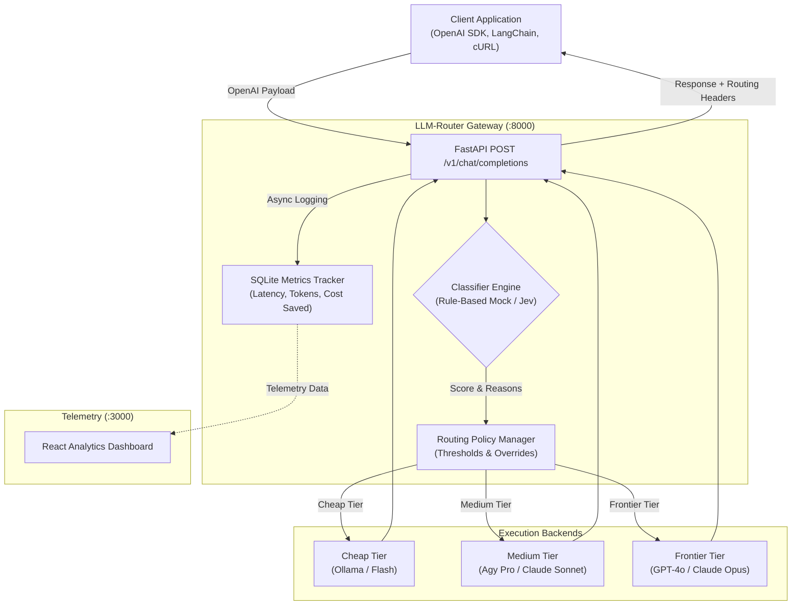

# LLM-Router

Intelligent, OpenAI-Compatible API Gateway with Cost-Optimized Dynamic Routing. Cuts LLM inference costs by routing routine prompts to cheap/local models and reserving frontier LLMs for high-complexity reasoning.

## Quickstart

**Docker:**
```bash
cp .env.example .env
docker compose up --build
```
- Gateway: http://localhost:8000
- Dashboard: http://localhost:3000

**Local:**
```bash
python3 -m venv .venv
source .venv/bin/activate
pip install -r requirements.txt
cp .env.example .env
uvicorn app.main:app --host 0.0.0.0 --port 8000
```
Dashboard: `cd web && npm install && npm run build`

## 🏗️ Architecture



### Components
- **Client Application**: Any application using OpenAI-compatible SDKs. Sends prompts exactly as if it were talking to OpenAI.
- **FastAPI Gateway**: The reverse proxy that intercepts `/v1/chat/completions`. Handles authentication, routing, and streaming responses (SSE).
- **Classifier Engine**: Analyzes inbound prompts in real-time. Uses TypeSafe AI's Jev for robust intent and complexity classification, or falls back to a rule-based mock for testing.
- **Routing Policy Manager**: Determines the optimal backend tier (cheap, medium, or frontier) based on the classifier's complexity score and any user-defined overrides.
- **Execution Backends**: The actual LLM providers.
  - *Cheap Tier*: Local models (Ollama) or extremely fast cloud models for routine queries.
  - *Medium Tier*: Balanced models for standard tasks.
  - *Frontier Tier*: State-of-the-art models (OpenAI GPT-4o, Anthropic Claude Opus) reserved for complex reasoning.
- **SQLite Metrics Tracker**: Logs request latency, token usage, and cost savings asynchronously to avoid blocking the main request cycle.
- **React Analytics Dashboard**: A real-time telemetry UI for visualizing traffic, routing decisions, and financial savings.


## Main Endpoints

- `POST /v1/chat/completions`: Standard OpenAI chat completion. Returns routing info in headers (`X-Router-Tier`, `X-Router-Model`, `X-Router-Saved-USD`).
- `POST /v1/classify`: Analyzes prompt complexity and suggests tier.

## Configuration

Set these in your `.env` file:

- `JEV_API_KEY`: TypeSafe AI key for Jev classifier
- `CLASSIFIER_MODE`: `mock` or `jev`
- `AGY_ENABLED`: `true` to use local Antigravity CLI backends
- `SIMULATE_FALLBACK`: `true` for offline testing
