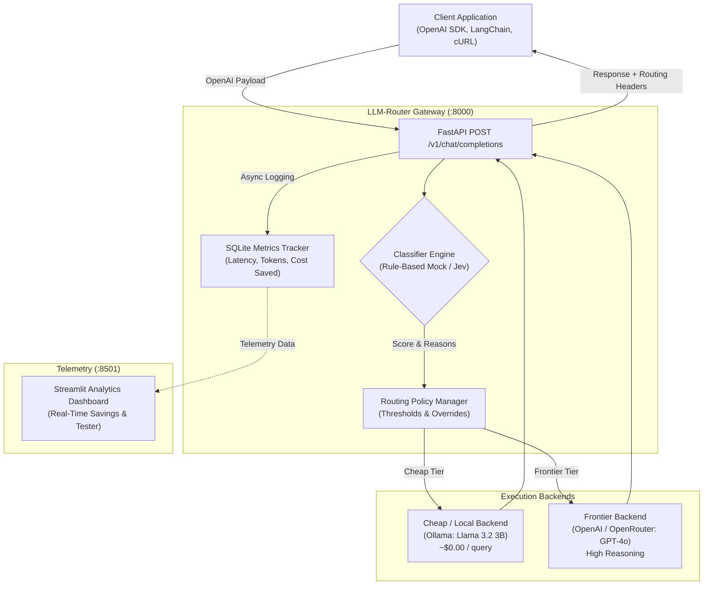

<div align="center">

# ⚡ LLM-Router

**Intelligent, OpenAI-Compatible API Gateway with Cost-Optimized Dynamic Routing**

[](https://www.python.org/downloads/)
[](https://fastapi.tiangolo.com)
[](https://streamlit.io)
[]()
[](https://opensource.org/licenses/MIT)

*Cut LLM inference costs by 70% to 85% by dynamically routing routine prompts to cheap/local models and reserving frontier LLMs for high-complexity reasoning.*

</div>

---

## 📌 Executive Pitch

In modern GenAI systems, **up to 80% of inbound requests** are routine queries: simple factual lookups, chit-chat greetings, formatting, basic translations, and lightweight summarizations. Paying top-tier rates ($5.00–$15.00 per 1M tokens) for frontier models like **GPT-4o** or **Claude 3.5 Sonnet** on these tasks produces massive unnecessary cloud spend.

**LLM-Router** acts as an intelligent, drop-in reverse proxy:
1. **Drop-in OpenAI Compatibility:** Point any existing `openai` client (`base_url="http://localhost:8000/v1"`) to LLM-Router without modifying application code.
2. **Intent & Complexity Classification:** Analyzes prompt complexity, code syntax, and reasoning depth in sub-millisecond time.
3. **Smart Tier Routing:** Directs simple queries to a **Cheap Backend** (e.g. local Ollama running `llama3.2:3b` at ~$0.00) and complex queries to a **Frontier Backend** (`gpt-4o`).
4. **Live Cost Telemetry:** Real-time metrics tracking requests, latency, and dollars saved via an integrated Streamlit dashboard.

---

## 🏗️ Architecture



---

## ✨ Features

- **Standard OpenAI Format:** Fully compliant `POST /v1/chat/completions` and `GET /v1/models` endpoints.
- **Typed Classifier Interface:** Clean `BaseClassifier` contract with explainable decision scoring (`score`, `confidence`, `reasons`).
- **Explainable Rule-Based Classifier:** Out-of-the-box heuristic classifier detecting code, algorithmic reasoning, formal proofs, and multi-turn complexity.
- **TypeSafe AI Jev Adapter:** Ready-to-use pluggable interface for TypeSafe AI's upcoming **Jev** classifier.
- **Configurable Routing Policy:** Override routing per-request via headers (`X-Router-Tier: cheap|frontier`) or model aliases (`router-cheap`, `router-frontier`).
- **Telemetry & Live Dashboard:** Streamlit monitoring app visualizing request volume, cheap vs. frontier breakdown, and dollar savings in real time.
- **Evaluation Benchmark Suite:** Built-in 20-prompt labeled dataset and evaluation runner with rich terminal analytics.

---

## 🚀 Quickstart

### 1. Prerequisites & Installation

```bash
git clone https://github.com/Ricos33/LLM-Router.git
cd LLM-Router

# Create and activate virtual environment
python3 -m venv .venv
source .venv/bin/activate

# Install dependencies
pip install -r requirements.txt
```

### 2. Configure Environment

Copy the example environment configuration:
```bash
cp .env.example .env
```
*(Optional) If you have an OpenAI API key or Ollama running locally, set them in `.env`. By default, `SIMULATE_FALLBACK=true` allows full end-to-end testing without external credentials.*

### 3. Start the Gateway

Launch the FastAPI gateway on port `8000`:
```bash
uvicorn app.main:app --host 0.0.0.0 --port 8000 --reload
```

Test with `curl`:
```bash
curl -X POST http://localhost:8000/v1/chat/completions \
  -H "Content-Type: application/json" \
  -d '{
    "model": "router-auto",
    "messages": [{"role": "user", "content": "What is the capital of France?"}]
  }'
```

Notice the diagnostic response headers:
- `X-Router-Tier: cheap`
- `X-Router-Model: llama3.2:3b`
- `X-Router-Saved-USD: 0.00115`

### 4. Launch the Streamlit Dashboard

Run the live analytics UI on port `8501`:
```bash
streamlit run dashboard/app.py
```
Open `http://localhost:8501` to view real-time traffic statistics, cumulative savings, and test prompts interactively.

### 5. Run Routing Evaluations

Benchmark classifier accuracy on the labeled dataset:
```bash
python evals/run_eval.py
```

### 6. Run Tests

```bash
pytest -v
```

---

## ⚙️ Environment Variables

| Variable | Default | Description |
|---|---|---|
| `PORT` | `8000` | HTTP port for the FastAPI gateway |
| `HOST` | `0.0.0.0` | Bind host address |
| `CLASSIFIER_MODE` | `mock` | `mock` (rule-based) or `jev` (TypeSafe AI) |
| `CLASSIFIER_CONFIDENCE_THRESHOLD` | `0.70` | Confidence threshold for routing decisions |
| `JEV_API_KEY` | `""` | TypeSafe AI API Key *(pending access)* |
| `CHEAP_PROVIDER` | `ollama` | Cheap provider (`ollama` or `openai_compatible`) |
| `CHEAP_API_BASE_URL` | `http://localhost:11434/v1` | URL for the cheap backend API |
| `CHEAP_MODEL` | `llama3.2:3b` | Target cheap model identifier |
| `CHEAP_PROMPT_PRICE_PER_M` | `0.15` | Estimated $/1M input tokens |
| `CHEAP_COMPLETION_PRICE_PER_M` | `0.60` | Estimated $/1M output tokens |
| `FRONTIER_PROVIDER` | `openai_compatible` | Frontier provider |
| `FRONTIER_API_BASE_URL` | `https://api.openai.com/v1` | URL for the frontier backend API |
| `FRONTIER_API_KEY` | `""` | Frontier API key |
| `FRONTIER_MODEL` | `gpt-4o` | Target frontier model identifier |
| `FRONTIER_PROMPT_PRICE_PER_M` | `5.00` | Estimated $/1M input tokens |
| `FRONTIER_COMPLETION_PRICE_PER_M` | `15.00` | Estimated $/1M output tokens |
| `SIMULATE_FALLBACK` | `true` | Return simulation when upstream providers are offline |
| `DATABASE_URL` | `sqlite:///./data/metrics.sqlite3` | SQLite path for metric logging |

---

## 🗺️ Roadmap

- [ ] **TypeSafe AI Jev Classifier Integration:** Seamless drop-in integration as soon as API access is provisioned.
- [ ] **SSE Streaming Support:** Low-latency streaming proxy (`stream=True`) preserving token-by-token TTFT.
- [ ] **Semantic Vector Routing:** Embedding-based similarity routing to fine-tuned domain-specific SLMs.
- [ ] **Automated Provider Fallback:** Automatic degradation/promotion on rate limits or timeout spikes (429/503).
- [ ] **Enterprise Token Budgets:** User and team-level quota enforcement.

---

## 📄 License

This project is licensed under the MIT License - see the [LICENSE](LICENSE) file for details.
