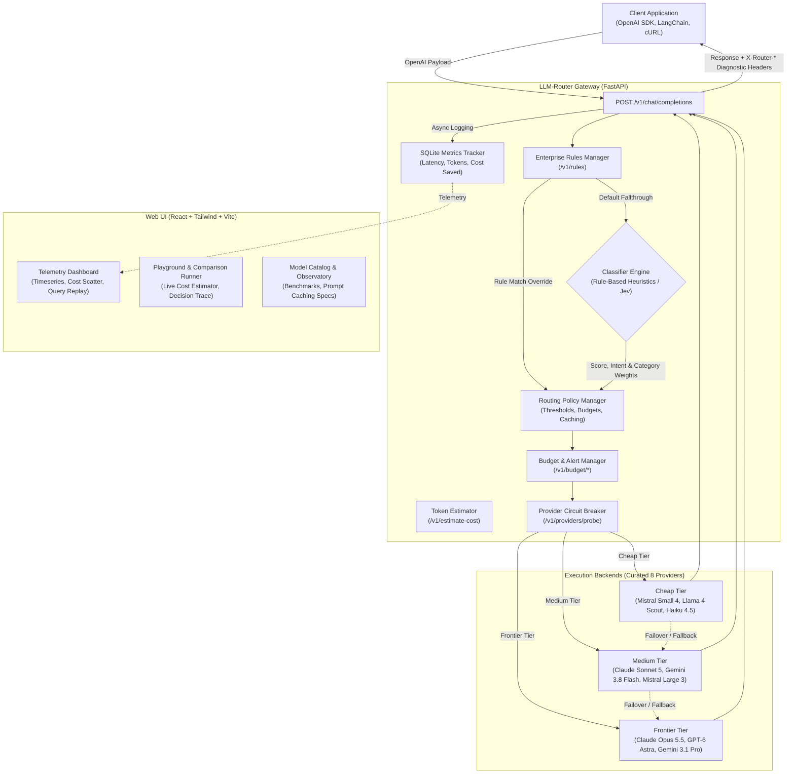

# LLM-Router 🚀


An intelligent, OpenAI-Compatible API Gateway with cost-optimized dynamic routing, enterprise policy rules, and empirical benchmark intelligence.

LLM-Router cuts LLM inference costs by up to **80%** by analyzing incoming prompts in real-time and routing routine queries to cheap or medium models, while reserving frontier models (such as Claude Opus 5.5, GPT-6 Astra, Gemini 3.1 Pro) exclusively for high-complexity reasoning, math, and code architecture tasks. Completely transparent to OpenAI SDK, LangChain, and REST clients.

---

## ✨ Key Features

- **🧠 Three-Tier Intelligent Routing**: Accurately classifies prompts into `cheap`, `medium`, and `frontier` tiers based on syntax, reasoning keywords, math/LaTeX, multi-lingual heuristics (FR/ES/DE/PT), code depth, and dialogue history.
- **🛡️ Enterprise Routing Rules & Policy Overrides**: Deterministic regex and word-boundary keyword rules with priority ordering, target models/tiers/providers, and full `/v1/rules` CRUD API.
- **💳 Enterprise Budget & Threshold Alerting**: Multi-stage budget threshold monitoring (50%, 80%, 90%, 100%), automated webhook dispatching (Slack, Discord, PagerDuty), alert history logging, and runtime configuration via `/v1/budget/*`.
- **💰 Pre-Execution Cost Preview & Token Estimator**: Heuristic tokenizer engine and `/v1/estimate-cost` API showing exact token counts, cost spread across all 23 models, and prompt caching savings before dispatch.
- **⚡ Prompt Caching Economics**: Comprehensive support for prompt prefix caching discounts (50% to 90% cuts) with live hit ratio simulation sliders and cumulative savings analytics.
- **🔬 Decision Trace & Transparent Explainability**: Complete heuristic signal deltas, dynamic benchmark weights, and fallback chain visibility via `/v1/classify/explain`.
- **⚡ Concurrent Model Comparison**: Side-by-side prompt execution across multiple models via `/v1/compare` with token, latency, cost spread analysis, and 1-click CSV/JSON export.
- **🎯 Curated 8-Provider Registry**: 23 verified September 2026 models from Anthropic, OpenAI, Google, Qwen, Mistral, DeepSeek, Meta, and xAI with verified pricing and empirical benchmarks (MMLU-Pro, GPQA Diamond, SWE-bench).
- **🩺 Synthetic Health Probing & Latency Radar**: Automatic failover, cooldown recovery, rolling latency tracking, and `/v1/providers/probe` connectivity monitoring.
- **📊 Real-time Telemetry Dashboard**: Interactive charts showing traffic, upstream provider distribution, model distribution, latency, 24h activity timeseries, cumulative cost savings, and 1-click query replay.
- **🔁 Multi-Step Fallback Chain**: Multi-tier failover (same-tier alternatives → frontier escalation → simulation safety net).
- **🔌 OpenAI Compatible**: Drop-in replacement for OpenAI API (`/v1/chat/completions`); just change the base URL.

---

## 🚀 Quickstart

**Docker (Recommended):**
```bash
cp .env.example .env
docker compose up --build
```
- Gateway API: `http://localhost:8000`
- Web Dashboard & Playground: `http://localhost:3000`

**Local Development:**
```bash
# Start Backend
python3 -m venv .venv
source .venv/bin/activate
pip install -r requirements.txt
cp .env.example .env
uvicorn app.main:app --host 0.0.0.0 --port 8000

# Start Frontend
cd web && npm install && npm run dev
```

### 💻 1-Minute SDK Integration

```python
from openai import OpenAI

# Simply redirect base_url to LLM-Router gateway
client = OpenAI(
    base_url="http://localhost:8000/v1",
    api_key="sk-local-router",  # Handled transparently by gateway
)

# Use "router-auto" for automatic routing, or specify any catalog model
response = client.chat.completions.create(
    model="router-auto",
    messages=[{"role": "user", "content": "Explain quantum teleportation and decoherence"}],
)

print(response.choices[0].message.content)
```

---

## 🏗️ Architecture



---

## 📋 Curated Model Catalog (September 2026)

LLM-Router restricts its active catalog to **8 premier providers** with verified pricing, prompt caching discounts, and empirical benchmark scores across Reasoning, Coding, Summary, and Creative tasks:

| Provider | Latest Models | Tiers | Input / Output ($/1M) | Prompt Cache Read |
|---|---|---|---|---|
| **Anthropic** | Claude Opus 5.5, Claude Fable 5.1, Claude Sonnet 5, Claude Haiku 4.5 | Frontier / Medium / Cheap | $1.00 – $10.00 / $5.00 – $50.00 | $0.10 – $1.00 (-90%) |
| **OpenAI** | GPT-6 Astra, GPT-5.6 Sol, GPT-5.6 Terra, GPT-5.6 Luna | Frontier / Medium / Cheap | $0.20 – $10.00 / $1.20 – $50.00 | $0.10 – $5.00 (-50%) |
| **Google** | Gemini 3.1 Pro, Gemini 3.8 Flash, Gemini 3.5 Flash-Lite | Frontier / Medium / Cheap | $0.30 – $2.00 / $2.50 – $12.00 | $0.075 – $0.50 (-75%) |
| **Qwen** | Qwen 3.8 Max, Qwen 3.8 Max Prime, Qwen 3.8 27B | Frontier / Cheap | $0.10 – $4.00 / $0.50 – $12.00 | $0.02 – $0.80 (-80%) |
| **Mistral** | Mistral Large 3, Mistral Small 4 | Medium / Cheap | $0.15 – $0.50 / $0.60 – $1.50 | $0.075 – $0.25 (-50%) |
| **DeepSeek** | DeepSeek V4 Pro, DeepSeek V4.1 Flash | Medium / Cheap | $0.30 – $1.32 / $1.20 – $3.96 | $0.03 – $0.132 (-90%) |
| **Meta** | Muse Spark 1.3, Llama 4 Maverick, Llama 4 Scout | Frontier / Medium / Cheap | $0.05 – $1.25 / $0.30 – $4.25 | $0.01 – $0.25 (-80%) |
| **xAI** | Grok 4.7, Grok 4.7 Fast | Frontier / Medium | $1.00 – $2.00 / $3.00 – $6.00 | $0.25 – $0.50 (-75%) |

Detailed benchmarks and sources can be found in [docs/benchmarks.md](docs/benchmarks.md).

---

## ⚙️ Configuration (.env)

| Variable | Default | Description |
|---|---|---|
| `PORT` | `8000` | HTTP port for the FastAPI gateway |
| `CLASSIFIER_MODE` | `mock` | `mock` (rule-based heuristic) or `jev` (TypeSafe AI) |
| `MONTHLY_BUDGET_USD` | `0.0` | Maximum monthly budget in USD (0.0 = unlimited) |
| `BUDGET_ALERT_WEBHOOK_URL` | *(empty)* | Webhook URL for automated threshold alerts (Slack/Discord) |
| `BUDGET_ALERT_THRESHOLDS` | `50,80,90,100` | Comma-separated percentages for triggering budget alerts |
| `CHEAP_PROVIDER` | `ollama` | Provider for cheap tier (`ollama`, `openai_compatible`) |
| `FRONTIER_PROVIDER` | `anthropic` | Provider for frontier tier (`anthropic`, `openai`, etc.) |
| `SIMULATE_FALLBACK` | `true` | Returns simulated responses if upstream APIs fail |
| `OPENAI_API_KEY` | *(empty)* | Optional API key for OpenAI |
| `ANTHROPIC_API_KEY` | *(empty)* | Optional API key for Anthropic |
| `GOOGLE_API_KEY` | *(empty)* | Optional API key for Google Gemini |
| `QWEN_API_KEY` | *(empty)* | Optional API key for Qwen (DashScope) |
| `MISTRAL_API_KEY` | *(empty)* | Optional API key for Mistral AI |
| `DEEPSEEK_API_KEY` | *(empty)* | Optional API key for DeepSeek |
| `META_API_KEY` | *(empty)* | Optional API key for Meta Llama |
| `XAI_API_KEY` | *(empty)* | Optional API key for xAI |

---

## 🧪 Testing

Run the automated test suite covering classification heuristics, enterprise routing rules, circuit breaker failovers, token estimation, cost calculations, and API endpoints:

```bash
pytest -v
```

112 comprehensive tests verifying routing integrity and failover safety.

---

## 🤝 Contributing
Contributions are welcome! Please check the issues page or open a PR.
